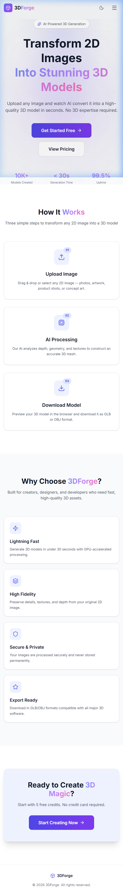
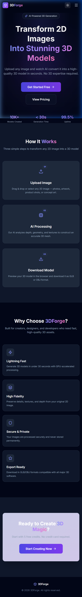
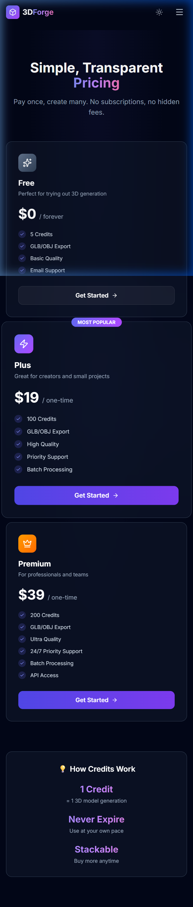
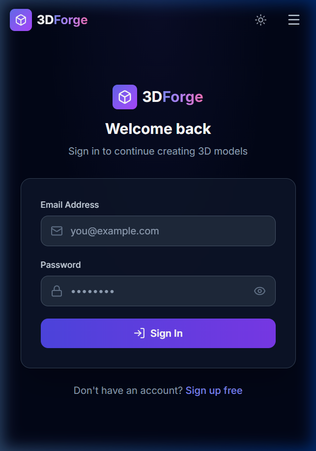

<div align="center">

# 🧊 3DForge — AI-Powered 2D to 3D Model Converter

[](https://github.com/PankajV91505/2d-to-3d-models-conversion)
[](https://vitejs.dev)
[](https://fastapi.tiangolo.com)
[](https://firebase.google.com)
[](LICENSE)

**Upload any 2D image → Get a downloadable, interactive 3D model in seconds, powered by AI!**

</div>

---

## ✨ Features

| Feature | Details |
|---|---|
| 🔐 **Authentication** | Secure login/signup via Firebase Auth |
| 🖼️ **AI 3D Generation** | Upload a JPG/PNG and receive a `.glb` or `.obj` 3D model |
| 🎮 **Interactive 3D Viewer** | Rotate, zoom, and pan the model directly in your browser (powered by Three.js) |
| 💳 **Credit System** | Each generation costs 1 credit; credits refill on plan upgrades |
| 💎 **Subscription Tiers** | Free, Plus, and Premium plans with different credit limits |
| 🤖 **Multi-Model Fallback** | Automatically tries multiple Hugging Face AI Spaces (colored meshes first, untextured as fallback) |
| 📥 **Download Models** | Download the generated `.glb`/`.obj` file directly |
| 🌗 **Dark / Light Mode** | Seamless theme toggle across the entire app |

---

## 🛠️ Technology Stack

**Frontend**
- [React](https://react.dev) + [Vite](https://vitejs.dev)
- [Tailwind CSS v4](https://tailwindcss.com) — Utility-first styling
- [@react-three/fiber](https://docs.pmnd.rs/react-three-fiber) & [@react-three/drei](https://github.com/pmndrs/drei) — 3D viewer
- [Firebase Auth](https://firebase.google.com/docs/auth) — Authentication
- [Lucide React](https://lucide.dev) — Icons
- [React Hot Toast](https://react-hot-toast.com) — Notifications

**Backend**
- [FastAPI](https://fastapi.tiangolo.com) — High-performance Python API
- [Firebase Admin SDK](https://firebase.google.com/docs/admin/setup) — Firestore DB & token verification
- [Gradio Client](https://www.gradio.app/docs/python-client) — Communicates with Hugging Face AI models
- [HTTPX](https://www.python-httpx.org) — Async HTTP for downloading generated 3D assets

---

## 🤖 AI Model Fallback Strategy

The backend dynamically tries multiple Hugging Face Spaces in priority order:

1. **TencentARC/Trellis-demo** — Colored textured meshes
2. **stabilityai/TripoSR** — Vertex-colored meshes
3. **ashawkey/LGM** — Colored models
4. **merve/daggr-image-to-3d** — Colored meshes
5. **frogleo/Image-to-3D** — White mesh (always-available fallback)

> ⚠️ Free public spaces can sleep due to GPU limits on Hugging Face. If colorful models are sleeping, the app gracefully falls back so generation never fully breaks.

---

## 🏗️ Project Structure

```
3D-Image-Conversion/
├── frontend/                   # React + Vite application
│   ├── src/
│   │   ├── components/         # Navbar, ModelViewer, ImageUpload, etc.
│   │   ├── context/            # AuthContext, ThemeContext
│   │   ├── pages/              # Landing, Login, Signup, Dashboard, Pricing
│   │   └── App.jsx             # Routes
│   └── package.json
│
└── backend/                    # FastAPI Python server
    ├── app/
    │   ├── middleware/          # Firebase JWT verification
    │   ├── routes/             # convert.py, upgrade.py
    │   ├── config.py           # Env var configuration
    │   └── main.py             # FastAPI entry point
    ├── models/                 # Generated 3D model files (gitignored)
    ├── uploads/                # Temp image uploads (gitignored)
    └── requirements.txt
```

---

## ⚙️ Local Development Setup

### Prerequisites
- Node.js v18+
- Python 3.10+
- A [Firebase Project](https://console.firebase.google.com) with **Authentication** and **Firestore** enabled
- (Optional) A [Hugging Face](https://huggingface.co) account for API token

### 1. Clone the Repository
```bash
git clone https://github.com/PankajV91505/2d-to-3d-models-conversion.git
cd 2d-to-3d-models-conversion
```

### 2. Firebase Setup
1. Go to the [Firebase Console](https://console.firebase.google.com).
2. Create a web app and copy the config into `frontend/src/config/firebase.config.js`.
3. Go to **Project Settings → Service Accounts** and generate a new private key.
4. Save the downloaded JSON as `backend/serviceAccountKey.json`.

### 3. Frontend Setup
```bash
cd frontend
npm install
npm run dev
```
Runs on `http://localhost:5173`

### 4. Backend Setup
```bash
cd backend
python -m venv venv
venv\Scripts\activate       # Windows
# source venv/bin/activate  # macOS/Linux

pip install -r requirements.txt

# Create .env file:
# FIREBASE_SERVICE_ACCOUNT_KEY=./serviceAccountKey.json
# HF_TOKEN=your_huggingface_token   (optional)

uvicorn app.main:app --reload --port 8000
```
API runs on `http://localhost:8000`

---

## 📸 Screenshots

### 🌞 Landing Page (Light Mode)


### 🌙 Landing Page (Dark Mode)


### 💎 Pricing Page


### 🚀 Dashboard


---

## 📜 License

This project is licensed under the [MIT License](LICENSE).

---

<div align="center">
Made with ❤️ by <a href="https://github.com/PankajV91505">PankajV91505</a>
</div>
